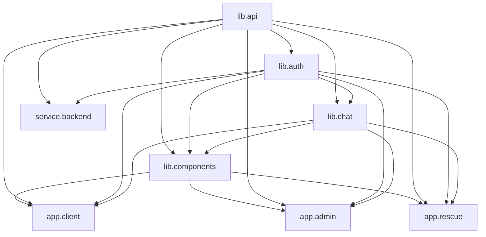

# 🏗️ Infrastructure Documentation

This document provides a comprehensive overview of the Adopt Don't Shop platform infrastructure, including microservices architecture, shared libraries, Docker setup, CI/CD, and database design.

## � Table of Contents
- [Architecture Overview](#architecture-overview)
- [Shared Libraries](#shared-libraries)
- [Microservices](#microservices)
- [Database Design](#database-design)
- [Docker & DevOps](#docker--devops)
- [CI/CD Pipeline](#cicd-pipeline)
- [Development Workflow](#development-workflow)
- [Production Deployment](#production-deployment)

## �️ Architecture Overview

The platform follows a modern microservices architecture with shared libraries to promote code reuse and maintainability.

```
┌─────────────────────────────────────────────────────────────┐
│                    Nginx Reverse Proxy                      │
│              (Subdomain-based routing)                      │
└─────────────────────┬───────────────────────────────────────┘
                      │
        ┌─────────────┼─────────────┐
        │             │             │
        ▼             ▼             ▼
┌─────────────┐ ┌─────────────┐ ┌─────────────┐
│ app.client  │ │ app.admin   │ │ app.rescue  │
│   (React)   │ │   (React)   │ │   (React)   │
│   Port:3000 │ │   Port:3001 │ │   Port:3002 │
└─────────────┘ └─────────────┘ └─────────────┘
        │             │             │
        └─────────────┼─────────────┘
                      │
                      ▼
              ┌─────────────┐
              │service.backend│
              │   (Node.js)  │
              │   Port:5000  │
              └─────────────┘
                      │
        ┌─────────────┼─────────────┐
        │             │             │
        ▼             ▼             ▼
┌─────────────┐ ┌─────────────┐ ┌─────────────┐
│ PostgreSQL  │ │    Redis    │ │   Uploads   │
│ (PostGIS)   │ │ (Sessions)  │ │   (Files)   │
│ Port:5432   │ │ Port:6379   │ │             │
└─────────────┘ └─────────────┘ └─────────────┘
```
│   ├── app.admin/      # Admin dashboard
│   ├── app.rescue/     # Rescue organization portal
│   └── service.backend/ # Main API service
├── 📚 Shared Libraries
│   ├── lib.api/        # API service utilities
│   ├── lib.auth/       # Authentication service
│   ├── lib.chat/       # Real-time chat functionality
│   └── lib.components/ # Shared UI components
├── 🐳 Infrastructure
│   ├── docker-compose.yml      # Main services
│   ├── docker-compose.libs.yml # Library development
│   └── nginx/                  # Reverse proxy
└── 🛠️ Scripts
    ├── create-new-app.js       # App generator
    └── create-new-lib.js       # Library generator
```

## 🚀 Quick Start Commands

### Development

```bash
# Start all services (apps + backend + libraries)
npm run dev:full

# Start only applications
npm run dev:apps

# Start only shared libraries
npm run dev:libs

# Start specific services
npm run dev:client    # Client app only
npm run dev:backend   # Backend API only
npm run dev:lib-chat  # Chat library only
```

### Docker Development

```bash
# Start main platform with Docker
docker-compose up

# Start only shared libraries
docker-compose -f docker-compose.libs.yml up

# Build and test specific library
docker-compose -f docker-compose.libs.yml run lib-chat-test
```

### Building

```bash
# Build everything
npm run build

# Build only libraries (needed before apps)
npm run build:libs

# Build only applications
npm run build:apps
```

## 🔄 Dependency Flow



## 🐳 Docker Infrastructure

### Main Services (docker-compose.yml)

| Service | Port | Purpose | Dependencies |
|---------|------|---------|--------------|
| `database` | 5432 | PostgreSQL with PostGIS | - |
| `redis` | 6379 | Caching and sessions | - |
| `service-backend` | 5000 | Main API service | database, redis |
| `app-client` | 3000 | Public React app | service-backend, all libs |
| `app-admin` | 3001 | Admin dashboard | service-backend, all libs |
| `app-rescue` | 3002 | Rescue portal | service-backend, all libs |
| `nginx` | 80/443 | Reverse proxy | all apps |

### Library Development (docker-compose.libs.yml)

| Service | Purpose | Volumes |
|---------|---------|---------|
| `lib-api` | API utilities development | `./lib.api:/app` |
| `lib-auth` | Auth service development | `./lib.auth:/app` |
| `lib-chat` | Chat service development | `./lib.chat:/app` |
| `lib-components` | UI components development | `./lib.components:/app` |

## 📦 Package Management

### Workspace Configuration

The project uses npm workspaces for monorepo management:

```json
{
  "workspaces": [
    "app.admin",
    "app.client", 
    "app.rescue",
    "lib.api",
    "lib.auth",
    "lib.chat",
    "lib.components",
    "service.backend"
  ]
}
```

### Library Dependencies

Libraries use workspace dependencies to reference each other:

```json
{
  "dependencies": {
    "@adopt-dont-shop/lib-api": "workspace:*",
    "@adopt-dont-shop/lib-auth": "workspace:*"
  }
}
```

## 🔧 Development Workflow

### 1. Creating New Libraries

```bash
# Generate new shared library
npm run new-lib <library-name> ["description"]

# Example
npm run new-lib analytics "User analytics and tracking"
```

This creates:
- Complete TypeScript setup
- Jest testing configuration  
- Docker integration
- Comprehensive documentation
- Turbo build integration

### 2. Creating New Applications

```bash
# Generate new application
npm run new-app <app-name> <app-type> ["description"]

# Example  
npm run new-app marketplace client "Pet marketplace app"
```

### 3. Adding Library to App

```bash
# 1. Add to app's package.json
{
  "dependencies": {
    "@adopt-dont-shop/lib-analytics": "workspace:*"
  }
}

# 2. Install dependencies
npm install

# 3. Use in code
import { analyticsService } from '@adopt-dont-shop/lib-analytics';
```

### 4. Docker Development

```bash
# Start library development environment
npm run docker:libs

# Test all libraries
npm run docker:libs-test

# Start full platform
docker-compose up
```

## 🏭 Build Pipeline

### Turbo Configuration

The build system uses Turbo for optimized builds with proper dependency management:

```json
{
  "tasks": {
    "build": {
      "dependsOn": ["^build"],
      "outputs": ["dist/**", "build/**"]
    },
    "dev": {
      "dependsOn": ["^build"],
      "cache": false,
      "persistent": true
    }
  }
}
```

### Build Order

1. **Libraries First**: All `lib.*` packages build first
2. **Applications**: Apps build after their library dependencies
3. **Testing**: Tests run after builds complete

## 🔒 Security & Best Practices

### Environment Variables

```bash
# Core services
POSTGRES_USER=user
POSTGRES_PASSWORD=password
POSTGRES_DB=adopt_dont_shop
JWT_SECRET=your-super-secret-jwt-key
REDIS_HOST=redis

# App-specific
VITE_API_URL=http://api.localhost
VITE_WS_URL=ws://api.localhost
CORS_ORIGIN=http://localhost:3000,http://localhost:3001,http://localhost:3002
```

### Container Security

- Non-root user execution
- Minimal Alpine images
- Multi-stage builds for production
- Security scanning integration

## 🚀 Deployment

### Production Docker Build

```bash
# Build production images
docker-compose -f docker-compose.prod.yml build

# Deploy with production configuration  
docker-compose -f docker-compose.prod.yml up -d
```

### Library Publishing

```bash
# Build library for publishing
cd lib.analytics
npm run build

# Publish to npm (if external)
npm publish
```

## 🔧 Troubleshooting

### Common Issues

**1. Library not found in app**
```bash
# Solution: Rebuild libraries first
npm run build:libs
npm run dev:apps
```

**2. Docker volume issues**
```bash
# Solution: Clean volumes and rebuild
docker-compose down -v
docker system prune -f
docker-compose up --build
```

**3. TypeScript errors in apps**
```bash
# Solution: Ensure libraries are built
npm run build:libs
npm run type-check
```

### Debug Commands

```bash
# Check workspace dependencies
npm ls --depth=0

# Verify Turbo cache
npx turbo run build --dry

# Test library imports
cd app.client
npm run type-check
```

## 📊 Monitoring

### Development Metrics

- **Build Times**: Tracked via Turbo
- **Library Usage**: Dependency analysis
- **Hot Reload**: File watching status
- **Container Health**: Docker health checks

### Production Metrics

- **Service Health**: HTTP endpoints
- **Database Connections**: PostgreSQL stats  
- **Cache Performance**: Redis metrics
- **Application Performance**: APM integration

## 🔄 Migration Guide

### From Monolith to Microservices

1. **Extract Shared Code**: Move common utilities to libraries
2. **Update Imports**: Replace relative imports with library imports
3. **Docker Integration**: Add library services to compose files
4. **Build Pipeline**: Update Turbo configuration
5. **Testing**: Verify cross-service functionality

### Adding New Services

1. **Generate Service**: Use `npm run new-app`
2. **Configure Dependencies**: Add required libraries
3. **Docker Setup**: Add to docker-compose.yml
4. **Proxy Configuration**: Update nginx routing
5. **Environment Variables**: Add service-specific config

---

## 📚 Additional Resources

- [Turbo Documentation](https://turbo.build/repo/docs)
- [npm Workspaces Guide](https://docs.npmjs.com/cli/v7/using-npm/workspaces)
- [Docker Compose Reference](https://docs.docker.com/compose/)
- [TypeScript Monorepo Setup](https://www.typescriptlang.org/docs/handbook/project-references.html)

For questions or support, see the individual README files in each package directory.
