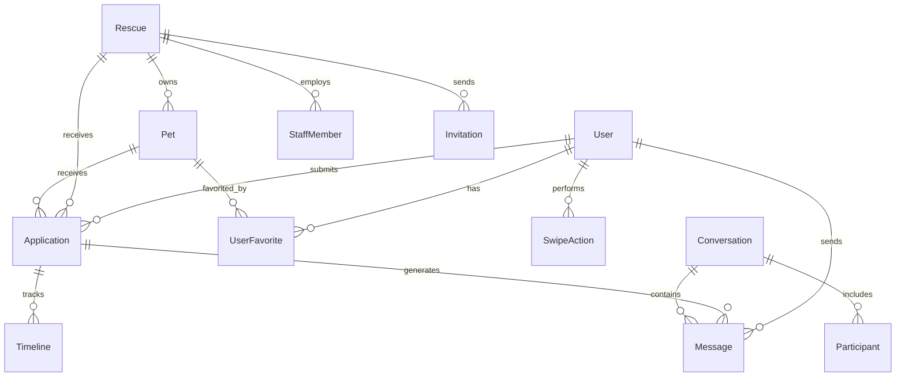

# Database Schema Documentation

## Overview

PostgreSQL database with Sequelize ORM supporting a comprehensive pet adoption platform. Includes user management, pet profiles, adoption workflows, messaging, and administrative features.

## Entity Relationships



## Core Tables

### Users
**Purpose**: Central user management for all platform participants

| Field | Type | Description |
|-------|------|-------------|
| user_id | UUID (PK) | Primary identifier |
| email | VARCHAR (UK) | Email address (unique) |
| password_hash | VARCHAR | Hashed password |
| first_name | VARCHAR | First name |
| last_name | VARCHAR | Last name |
| phone_number | VARCHAR | Contact number |
| user_type | ENUM | ADOPTER, RESCUE_STAFF, ADMIN |
| status | ENUM | ACTIVE, SUSPENDED, DELETED |
| email_verified | BOOLEAN | Email verification status |
| created_at | TIMESTAMP | Registration date |
| updated_at | TIMESTAMP | Last update |

**Indexes**: email, user_type, status

### Rescues
**Purpose**: Rescue organization profiles and settings

| Field | Type | Description |
|-------|------|-------------|
| rescue_id | UUID (PK) | Primary identifier |
| rescue_name | VARCHAR | Organization name |
| rescue_type | VARCHAR | Type of rescue org |
| reference_number | VARCHAR (UK) | Unique reference |
| verified | BOOLEAN | Verification status |
| email | VARCHAR | Contact email |
| phone | VARCHAR | Contact phone |
| address | JSONB | Physical address |
| location | GEOGRAPHY | GIS coordinates |
| created_at | TIMESTAMP | Registration date |

**Indexes**: verified, location (GIS index)

### Pets
**Purpose**: Pet profiles and availability

| Field | Type | Description |
|-------|------|-------------|
| pet_id | UUID (PK) | Primary identifier |
| rescue_id | UUID (FK) | Owning rescue |
| name | VARCHAR | Pet name |
| type | ENUM | DOG, CAT, OTHER |
| breed | VARCHAR | Breed information |
| age | INTEGER | Age in months |
| gender | ENUM | MALE, FEMALE |
| size | ENUM | SMALL, MEDIUM, LARGE |
| status | ENUM | AVAILABLE, PENDING, ADOPTED, MEDICAL, DECEASED |
| description | TEXT | Pet description |
| special_needs | TEXT | Special care requirements |
| images | JSONB | Array of image URLs |
| medical_history | JSONB | Medical records |
| adoption_fee | DECIMAL | Adoption fee amount |
| created_at | TIMESTAMP | Listed date |

**Indexes**: rescue_id, type, status, breed

### Applications
**Purpose**: Adoption application tracking

| Field | Type | Description |
|-------|------|-------------|
| application_id | UUID (PK) | Primary identifier |
| user_id | UUID (FK) | Applicant |
| pet_id | UUID (FK) | Applied pet |
| rescue_id | UUID (FK) | Rescue org |
| stage | ENUM | PENDING, REVIEWING, VISITING, DECIDING, RESOLVED |
| final_outcome | ENUM | APPROVED, CONDITIONAL, REJECTED, WITHDRAWN |
| answers | JSONB | Application answers |
| review_started_at | TIMESTAMP | Review start time |
| visit_scheduled_at | TIMESTAMP | Visit scheduled |
| visit_completed_at | TIMESTAMP | Visit completion |
| resolved_at | TIMESTAMP | Resolution time |
| created_at | TIMESTAMP | Submission date |

**Indexes**: user_id, pet_id, rescue_id, stage, final_outcome

### Staff Members
**Purpose**: Rescue staff and volunteer management

| Field | Type | Description |
|-------|------|-------------|
| staff_member_id | UUID (PK) | Primary identifier |
| user_id | UUID (FK) | User account |
| rescue_id | UUID (FK) | Rescue org |
| role | ENUM | ADMIN, MANAGER, STAFF, VOLUNTEER |
| verified_by_rescue | BOOLEAN | Verification status |
| permissions | JSONB | Role permissions |
| created_at | TIMESTAMP | Join date |

**Indexes**: user_id, rescue_id, role

## Communication Tables

### Conversations
**Purpose**: Message thread management

| Field | Type | Description |
|-------|------|-------------|
| conversation_id | UUID (PK) | Primary identifier |
| application_id | UUID (FK) | Related application (optional) |
| title | VARCHAR | Conversation title |
| type | ENUM | DIRECT, GROUP, APPLICATION |
| created_at | TIMESTAMP | Creation date |

### Messages
**Purpose**: Individual messages

| Field | Type | Description |
|-------|------|-------------|
| message_id | UUID (PK) | Primary identifier |
| conversation_id | UUID (FK) | Parent conversation |
| sender_id | UUID (FK) | Message sender |
| content | TEXT | Message content |
| attachments | JSONB | File attachments |
| read_by | JSONB | Read receipts |
| created_at | TIMESTAMP | Send time |

**Indexes**: conversation_id, sender_id, created_at

### Notifications
**Purpose**: User notifications

| Field | Type | Description |
|-------|------|-------------|
| notification_id | UUID (PK) | Primary identifier |
| user_id | UUID (FK) | Recipient |
| type | VARCHAR | Notification type |
| title | VARCHAR | Notification title |
| message | TEXT | Content |
| data | JSONB | Additional data |
| read | BOOLEAN | Read status |
| created_at | TIMESTAMP | Creation time |

**Indexes**: user_id, read, created_at

## Discovery Tables

### Swipe Actions
**Purpose**: User swipe behavior tracking

| Field | Type | Description |
|-------|------|-------------|
| action_id | UUID (PK) | Primary identifier |
| user_id | UUID (FK) | User performing action |
| pet_id | UUID (FK) | Pet swiped |
| action_type | ENUM | LIKE, PASS, SUPER_LIKE |
| session_id | VARCHAR | Session identifier |
| created_at | TIMESTAMP | Action time |

**Indexes**: user_id, pet_id, action_type, session_id

### User Favorites
**Purpose**: Saved pets

| Field | Type | Description |
|-------|------|-------------|
| favorite_id | UUID (PK) | Primary identifier |
| user_id | UUID (FK) | User |
| pet_id | UUID (FK) | Favorited pet |
| created_at | TIMESTAMP | Save time |

**Indexes**: user_id, pet_id (unique together)

## Management Tables

### Invitations
**Purpose**: Staff invitation management

| Field | Type | Description |
|-------|------|-------------|
| invitation_id | UUID (PK) | Primary identifier |
| rescue_id | UUID (FK) | Inviting rescue |
| email | VARCHAR | Invitee email |
| role | ENUM | Intended role |
| token | VARCHAR (UK) | Invitation token |
| status | ENUM | PENDING, ACCEPTED, EXPIRED |
| expires_at | TIMESTAMP | Expiration time |
| created_at | TIMESTAMP | Invitation date |

**Indexes**: token, email, rescue_id, status

### Timeline Events
**Purpose**: Application history tracking

| Field | Type | Description |
|-------|------|-------------|
| event_id | UUID (PK) | Primary identifier |
| application_id | UUID (FK) | Related application |
| event_type | VARCHAR | Event type |
| event_data | JSONB | Event details |
| created_by | UUID (FK) | User who created event |
| created_at | TIMESTAMP | Event time |

**Indexes**: application_id, event_type, created_at

## System Tables

### Email Queue
**Purpose**: Outbound email management

| Field | Type | Description |
|-------|------|-------------|
| email_id | UUID (PK) | Primary identifier |
| recipient_email | VARCHAR | Recipient |
| template_id | VARCHAR | Email template |
| variables | JSONB | Template variables |
| status | ENUM | PENDING, SENT, FAILED |
| sent_at | TIMESTAMP | Send time |
| created_at | TIMESTAMP | Queue time |

**Indexes**: status, created_at

## Database Performance

### Index Strategy
- **Primary Keys**: All tables use UUID primary keys with b-tree indexes
- **Foreign Keys**: Indexed for join performance
- **Lookups**: Additional indexes on frequently queried fields
- **Geospatial**: PostGIS indexes for location-based queries
- **Full-Text**: Text search indexes on descriptions

### Optimization
- **Partitioning**: Consider for large tables (messages, notifications)
- **Archival**: Old data moved to archive tables
- **Caching**: Frequently accessed data cached at application layer
- **Connection Pooling**: Managed by Sequelize

## Data Integrity

### Constraints
- **NOT NULL**: Required fields
- **UNIQUE**: Email addresses, tokens, reference numbers
- **CHECK**: Enum values, valid ranges
- **Foreign Keys**: Referential integrity with CASCADE/RESTRICT

### Soft Deletes
Most tables use soft delete (deleted_at timestamp) instead of hard delete for:
- Data recovery capability
- Audit trail preservation
- Relationship integrity

## Migrations

### Migration Management
```bash
# Create migration
npm run migration:create -- --name add-new-field

# Run migrations
npm run db:migrate

# Rollback
npm run db:migrate:undo
```

### Best Practices
- Never modify existing migrations
- Use transactions for complex migrations
- Include rollback logic
- Test migrations on staging first

## Security

### Sensitive Data
- **Passwords**: bcrypt hashing (12 rounds)
- **Tokens**: Cryptographically secure random generation
- **Personal Data**: Encrypted at rest
- **Audit Logging**: All modifications tracked

### Access Control
- Database users with minimal privileges
- Application-level permission checks
- Row-level security for multi-tenancy (future)

## Additional Resources

- **API Endpoints**: [api-endpoints.md](./api-endpoints.md)
- **Service PRD**: [service-backend-prd.md](./service-backend-prd.md)
- **Implementation Guide**: [implementation-guide.md](./implementation-guide.md)
- **Testing Guide**: [testing.md](./testing.md)
