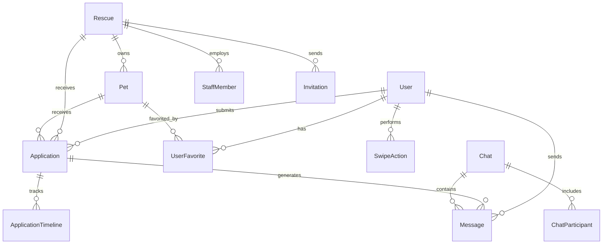

# Database Schema Documentation

## Overview

PostgreSQL 16 with the PostGIS extension and Sequelize 7. Models live in `service.backend/src/models/` and are mirrored 1:1 by baseline migrations under `service.backend/src/migrations/`. This document is a high-level reference — the source of truth is always the model file.

## Entity Relationships


```mermaid
erDiagram
    User ||--o{ Application : submits
    User ||--o{ Message : sends
    User ||--o{ UserFavorite : has
    User ||--o{ SwipeAction : performs

    Rescue ||--o{ Pet : owns
    Rescue ||--o{ StaffMember : employs
    Rescue ||--o{ Application : receives
    Rescue ||--o{ Invitation : sends

    Pet ||--o{ Application : receives
    Pet ||--o{ UserFavorite : favorited_by

    Application ||--o{ ApplicationTimeline : tracks
    Application ||--o{ Message : generates

    Chat ||--o{ Message : contains
    Chat ||--o{ ChatParticipant : includes
```

## Core Tables

### Users

**Purpose**: Central user management for all platform participants. Defined in `User.ts`.

| Field          | Type         | Description                                                                          |
| -------------- | ------------ | ------------------------------------------------------------------------------------ |
| user_id        | UUID (PK)    | Primary identifier                                                                   |
| email          | VARCHAR (UK) | Email address (unique)                                                               |
| password       | VARCHAR      | bcrypt-hashed password (bcrypt 12 rounds; column is `password`, not `password_hash`) |
| first_name     | VARCHAR      | First name                                                                           |
| last_name      | VARCHAR      | Last name                                                                            |
| phone_number   | VARCHAR      | Contact number                                                                       |
| user_type      | ENUM         | `adopter`, `rescue_staff`, `admin`, `moderator`, `super_admin`, `support_agent`      |
| status         | ENUM         | `active`, `inactive`, `suspended`, `pending_verification`, `deactivated`             |
| email_verified | BOOLEAN      | Email verification status                                                            |
| created_at     | TIMESTAMP    | Registration date                                                                    |
| updated_at     | TIMESTAMP    | Last update                                                                          |
| deleted_at     | TIMESTAMP    | Soft-delete timestamp (paranoid)                                                     |

**Indexes**: email, user_type, status

> The model also defines optional columns for two-factor (`two_factor_secret`, `backup_codes`), reset/verification tokens, address fields, and a PostGIS `location` point. See `User.ts` for the full attribute list.

### Rescues

**Purpose**: Rescue organization profiles and settings. Defined in `Rescue.ts`.

| Field                        | Type         | Description                                              |
| ---------------------------- | ------------ | -------------------------------------------------------- |
| rescue_id                    | UUID (PK)    | Primary identifier                                       |
| name                         | VARCHAR      | Organization name                                        |
| email                        | VARCHAR      | Contact email                                            |
| phone                        | VARCHAR      | Contact phone                                            |
| address_line_1               | VARCHAR      | Street address                                           |
| city / state / zip_code      | VARCHAR      | UK locality fields (mapped to existing columns)          |
| country                      | CHAR(2)      | ISO-3166 country code (default `GB`)                     |
| companies_house_number       | VARCHAR      | Companies House registration (UK verification source)    |
| charity_registration_number  | VARCHAR      | Charity Commission registration                          |
| verification_status          | ENUM         | `pending`, `verified`, `rejected`                        |
| verified_at / verified_by    | TIMESTAMP / UUID | Verification audit                                   |
| settings                     | JSONB        | Per-rescue feature settings                              |
| plan                         | VARCHAR      | Subscription plan (default `free`)                       |
| created_at / updated_at      | TIMESTAMP    | Auditing                                                 |

**Indexes**: verified_by, deleted_at (soft delete)

### Pets

**Purpose**: Pet profiles and availability. Defined in `Pet.ts`.

| Field                   | Type      | Description                                                                                              |
| ----------------------- | --------- | -------------------------------------------------------------------------------------------------------- |
| pet_id                  | UUID (PK) | Primary identifier                                                                                       |
| rescue_id               | UUID (FK) | Owning rescue                                                                                            |
| name                    | VARCHAR   | Pet name                                                                                                 |
| type                    | ENUM      | `dog`, `cat`, `rabbit`, `bird`, `reptile`, `small_mammal`, `fish`, `other`                               |
| breed                   | VARCHAR   | Breed information                                                                                        |
| age_years / age_months  | INTEGER   | Age components (also `birth_date` + `age_group`)                                                         |
| gender                  | ENUM      | `male`, `female`, `unknown`                                                                              |
| size                    | ENUM      | `extra_small`, `small`, `medium`, `large`, `extra_large`                                                 |
| status                  | ENUM      | `available`, `pending`, `adopted`, `foster`, `medical_hold`, `behavioral_hold`, `not_available`, `deceased` |
| short_description       | TEXT      | Card / list copy                                                                                         |
| long_description        | TEXT      | Full profile body                                                                                        |
| medical_notes           | TEXT      | Free-text vet notes (no separate `medical_history` JSON column)                                          |
| adoption_fee_minor      | INTEGER   | Fee in minor currency units (e.g. pence). Pair with `adoption_fee_currency`.                             |
| adoption_fee_currency   | CHAR(3)   | ISO-4217 currency code                                                                                   |
| created_at / updated_at | TIMESTAMP | Auditing                                                                                                 |

**Indexes**: rescue_id, type, status, breed

> Pet images and videos live in the separate **`pet_media`** table (`PetMedia.ts`) — there is no `images` JSONB column on `pets`. Status transitions are append-only in `pet_status_transitions`.

### Applications

**Purpose**: Adoption application tracking. Defined in `Application.ts`.

| Field              | Type      | Description                                                                       |
| ------------------ | --------- | --------------------------------------------------------------------------------- |
| application_id     | UUID (PK) | Primary identifier                                                                |
| user_id            | UUID (FK) | Applicant                                                                         |
| pet_id             | UUID (FK) | Applied pet                                                                       |
| rescue_id          | UUID (FK) | Rescue org                                                                        |
| status             | ENUM      | `submitted`, `approved`, `rejected`, `withdrawn` (simplified outcome)             |
| priority           | ENUM      | `low`, `normal`, `high`, `urgent`                                                 |
| stage              | ENUM      | `pending`, `reviewing`, `visiting`, `deciding`, `resolved`, `withdrawn`           |
| final_outcome      | ENUM      | `approved`, `rejected`, `withdrawn` (set when `stage = resolved`)                 |
| review_started_at  | TIMESTAMP | Review start time                                                                 |
| visit_scheduled_at | TIMESTAMP | Visit scheduled                                                                   |
| visit_completed_at | TIMESTAMP | Visit completion                                                                  |
| resolved_at        | TIMESTAMP | Resolution time                                                                   |
| documents          | JSONB     | Uploaded supporting documents                                                     |
| created_at         | TIMESTAMP | Submission date                                                                   |

**Indexes**: user_id, pet_id, rescue_id, stage, status

> Application **answers** live in the separate `application_answers` table (`ApplicationAnswer.ts`), and **references** in `application_references` (`ApplicationReference.ts`). Stage/status changes are mirrored in `application_status_transitions` and `application_timeline` for audit.

### Staff Members

**Purpose**: Junction table linking users to the rescues they staff. Defined in `StaffMember.ts`. RBAC roles live on the `user_roles` table — staff_members does **not** store roles or permissions itself.

| Field           | Type      | Description                                          |
| --------------- | --------- | ---------------------------------------------------- |
| staff_member_id | UUID (PK) | Primary identifier                                   |
| rescue_id       | UUID (FK) | Rescue org (FK → rescues)                            |
| user_id         | UUID (FK) | User account (FK → users)                            |
| title           | VARCHAR   | Free-text role/title (e.g. "Adoptions Coordinator")  |
| is_verified     | BOOLEAN   | Verified-by-rescue flag                              |
| verified_by     | UUID (FK) | User who verified (nullable)                         |
| verified_at     | TIMESTAMP | When verified                                        |
| added_by        | UUID (FK) | Who added the staffer                                |
| added_at        | TIMESTAMP | When added                                           |
| deleted_at      | TIMESTAMP | Soft-delete timestamp (paranoid)                     |

**Indexes**: user_id, rescue_id

## Communication Tables

### Chats

**Purpose**: Chat thread management between adopters and rescues. Defined in `Chat.ts`.

| Field          | Type      | Description                                |
| -------------- | --------- | ------------------------------------------ |
| chat_id        | UUID (PK) | Primary identifier                         |
| rescue_id      | UUID (FK) | Owning rescue                              |
| pet_id         | UUID (FK) | Pet that initiated the chat (optional)     |
| application_id | UUID (FK) | Related application (optional)             |
| status         | ENUM      | `active`, `locked`, `archived`             |
| created_at     | TIMESTAMP | Creation date                              |
| updated_at     | TIMESTAMP | Last update                                |

**Indexes**: rescue_id, pet_id, application_id, status

### Chat Participants

**Purpose**: Junction table linking users to chats. Defined in `ChatParticipant.ts`.

| Field    | Type      | Description           |
| -------- | --------- | --------------------- |
| chat_id  | UUID (FK) | Parent chat           |
| user_id  | UUID (FK) | Participant user      |
| role     | ENUM      | Participant role      |

### Messages

**Purpose**: Individual messages within a chat. Defined in `Message.ts`.

| Field             | Type      | Description                                                          |
| ----------------- | --------- | -------------------------------------------------------------------- |
| message_id        | UUID (PK) | Primary identifier                                                   |
| chat_id           | UUID (FK) | Parent chat                                                          |
| sender_id         | UUID (FK) | Message sender                                                       |
| content           | TEXT      | Message content                                                      |
| content_format    | ENUM      | Content type (e.g. plain / markdown)                                 |
| attachments       | JSONB     | File attachments                                                     |
| search_vector     | TSVECTOR  | Stored generated column for full-text search (`messages_search_vector_gin_idx`) |
| is_flagged        | BOOLEAN   | Content-moderation flag                                              |
| flag_reason       | VARCHAR   | Reason set when flagged                                              |
| flag_severity     | ENUM      | Severity from moderation pipeline                                    |
| moderation_status | ENUM      | Outcome of moderation scan                                           |
| flagged_at        | TIMESTAMP | When the flag was applied                                            |
| created_at        | TIMESTAMP | Send time                                                            |

Read receipts are tracked in a separate `MessageRead` table; reactions in `MessageReaction`.

**Indexes**: chat_id, sender_id, created_at, search_vector (GIN)

### Notifications

**Purpose**: Multi-channel user notifications. Defined in `Notification.ts`.

| Field                   | Type      | Description                                                                       |
| ----------------------- | --------- | --------------------------------------------------------------------------------- |
| notification_id         | UUID (PK) | Primary identifier                                                                |
| user_id                 | UUID (FK) | Recipient                                                                         |
| type                    | ENUM      | Notification category (see `NotificationType`)                                    |
| channel                 | ENUM      | Delivery channel (email / push / in-app / SMS)                                    |
| priority                | ENUM      | `low`, `normal`, `high`, `urgent`                                                 |
| status                  | ENUM      | `pending`, `sent`, `delivered`, `read`, `failed`, `cancelled`                     |
| title                   | VARCHAR   | Notification title                                                                |
| message                 | TEXT      | Content                                                                           |
| data                    | JSONB     | Additional data                                                                   |
| template_id             | VARCHAR   | Optional template reference                                                       |
| template_variables      | JSONB     | Template substitution values                                                      |
| scheduled_for           | TIMESTAMP | Send-after timestamp                                                              |
| sent_at / delivered_at  | TIMESTAMP | Lifecycle timestamps                                                              |
| read_at / clicked_at    | TIMESTAMP | Engagement timestamps (there is **no** boolean `read` column — use `read_at` / `status = read`) |
| retry_count / max_retries | INTEGER | Delivery retry bookkeeping                                                        |
| error_message           | VARCHAR   | Last failure reason                                                               |
| external_id             | VARCHAR   | Provider message ID                                                               |
| created_at              | TIMESTAMP | Creation time                                                                     |

**Indexes**: user_id, status, created_at

## Discovery Tables

### Swipe Actions

**Purpose**: User swipe behavior tracking

| Field       | Type      | Description            |
| ----------- | --------- | ---------------------- |
| action_id   | UUID (PK) | Primary identifier     |
| user_id     | UUID (FK) | User performing action |
| pet_id      | UUID (FK) | Pet swiped             |
| action_type | ENUM      | LIKE, PASS, SUPER_LIKE |
| session_id  | VARCHAR   | Session identifier     |
| created_at  | TIMESTAMP | Action time            |

**Indexes**: user_id, pet_id, action_type, session_id

### User Favorites

**Purpose**: Saved pets

| Field       | Type      | Description        |
| ----------- | --------- | ------------------ |
| favorite_id | UUID (PK) | Primary identifier |
| user_id     | UUID (FK) | User               |
| pet_id      | UUID (FK) | Favorited pet      |
| created_at  | TIMESTAMP | Save time          |

**Indexes**: user_id, pet_id (unique together)

## Management Tables

### Invitations

**Purpose**: Staff invitation management

| Field         | Type         | Description                |
| ------------- | ------------ | -------------------------- |
| invitation_id | UUID (PK)    | Primary identifier         |
| rescue_id     | UUID (FK)    | Inviting rescue            |
| email         | VARCHAR      | Invitee email              |
| role          | ENUM         | Intended role              |
| token         | VARCHAR (UK) | Invitation token           |
| status        | ENUM         | PENDING, ACCEPTED, EXPIRED |
| expires_at    | TIMESTAMP    | Expiration time            |
| created_at    | TIMESTAMP    | Invitation date            |

**Indexes**: token, email, rescue_id, status

### Application Timeline

**Purpose**: Application history tracking (`ApplicationTimeline.ts`).

| Field          | Type      | Description            |
| -------------- | --------- | ---------------------- |
| event_id       | UUID (PK) | Primary identifier     |
| application_id | UUID (FK) | Related application    |
| event_type     | VARCHAR   | Event type             |
| event_data     | JSONB     | Event details          |
| created_by     | UUID (FK) | User who created event |
| created_at     | TIMESTAMP | Event time             |

**Indexes**: application_id, event_type, created_at

## System Tables

### Email Queue

**Purpose**: Outbound email management. Defined in `EmailQueue.ts`.

| Field             | Type      | Description                                          |
| ----------------- | --------- | ---------------------------------------------------- |
| email_id          | UUID (PK) | Primary identifier                                   |
| template_id       | VARCHAR   | Email template                                       |
| from_email / from_name | VARCHAR | Sender envelope                                    |
| to_email          | VARCHAR   | Recipient (column is `to_email`, not `recipient_email`) |
| to_name           | VARCHAR   | Recipient display name                               |
| cc_emails         | JSONB     | CC list                                              |
| bcc_emails        | JSONB     | BCC list                                             |
| reply_to_email    | VARCHAR   | Reply-to address                                     |
| html_content / text_content | TEXT | Rendered bodies                                  |
| template_data     | JSONB     | Template substitution values                         |
| status            | ENUM      | Delivery status                                      |
| scheduled_for     | TIMESTAMP | Send-after timestamp                                 |
| max_retries / current_retries | INTEGER | Retry bookkeeping                            |
| last_attempt_at / sent_at | TIMESTAMP | Lifecycle timestamps                             |
| failure_reason    | TEXT      | Last error                                           |
| provider_id / provider_message_id | VARCHAR | Provider correlation                         |
| created_at        | TIMESTAMP | Queue time                                           |

**Indexes**: status, created_at

## Database Performance

### Index Strategy

- **Primary Keys**: All tables use UUID primary keys with b-tree indexes
- **Foreign Keys**: Indexed for join performance
- **Lookups**: Additional indexes on frequently queried fields
- **Geospatial**: PostGIS indexes for location-based queries
- **Full-Text**: Text search indexes on descriptions

### Optimization

- **Partitioning**: Consider for large tables (messages, notifications)
- **Archival**: Old data moved to archive tables
- **Caching**: Frequently accessed data cached at application layer
- **Connection Pooling**: Managed by Sequelize

## Data Integrity

### Constraints

- **NOT NULL**: Required fields
- **UNIQUE**: Email addresses, tokens, reference numbers
- **CHECK**: Enum values, valid ranges
- **Foreign Keys**: Referential integrity with CASCADE/RESTRICT

### Soft Deletes

Most tables use soft delete (deleted_at timestamp) instead of hard delete for:

- Data recovery capability
- Audit trail preservation
- Relationship integrity

## Migrations

### Migration Management

Migrations live in `service.backend/src/migrations/` as numbered TypeScript files (e.g. `00-baseline-001-users.ts`, `01-add-user-type-support-agent-super-admin.ts`). The project uses [Umzug](https://github.com/sequelize/umzug) via a custom runner at `service.backend/src/migrations/runner.ts` — **`sequelize-cli` is not installed**. Create a new migration by adding the next sequential file following the existing pattern.

```bash
# From the repo root, while the dev stack is running:
npm run db:migrate

# Rollback / status (run inside the backend container):
npm run docker:shell:backend
npm run db:migrate:undo      # ts-node src/migrations/runner.ts down
npm run db:migrate:status    # ts-node src/migrations/runner.ts status
```

The backend exposes three migration scripts in `service.backend/package.json`: `db:migrate`, `db:migrate:undo`, `db:migrate:status`.

### Best Practices

- Never modify existing migrations
- Use transactions for complex migrations
- Include rollback logic
- Test migrations on staging first

## Security

### Sensitive Data

- **Passwords**: bcrypt hashing (12 rounds)
- **Tokens**: Cryptographically secure random generation
- **Personal Data**: Encrypted at rest
- **Audit Logging**: All modifications tracked

### Access Control

- Database users with minimal privileges
- Application-level permission checks
- Row-level security for multi-tenancy (future)

## Additional Resources

- **API Endpoints**: [api-endpoints.md](./api-endpoints.md)
- **Service PRD**: [service-backend-prd.md](./service-backend-prd.md)
- **Implementation Guide**: [implementation-guide.md](./implementation-guide.md)
- **Testing Guide**: [testing.md](./testing.md)
