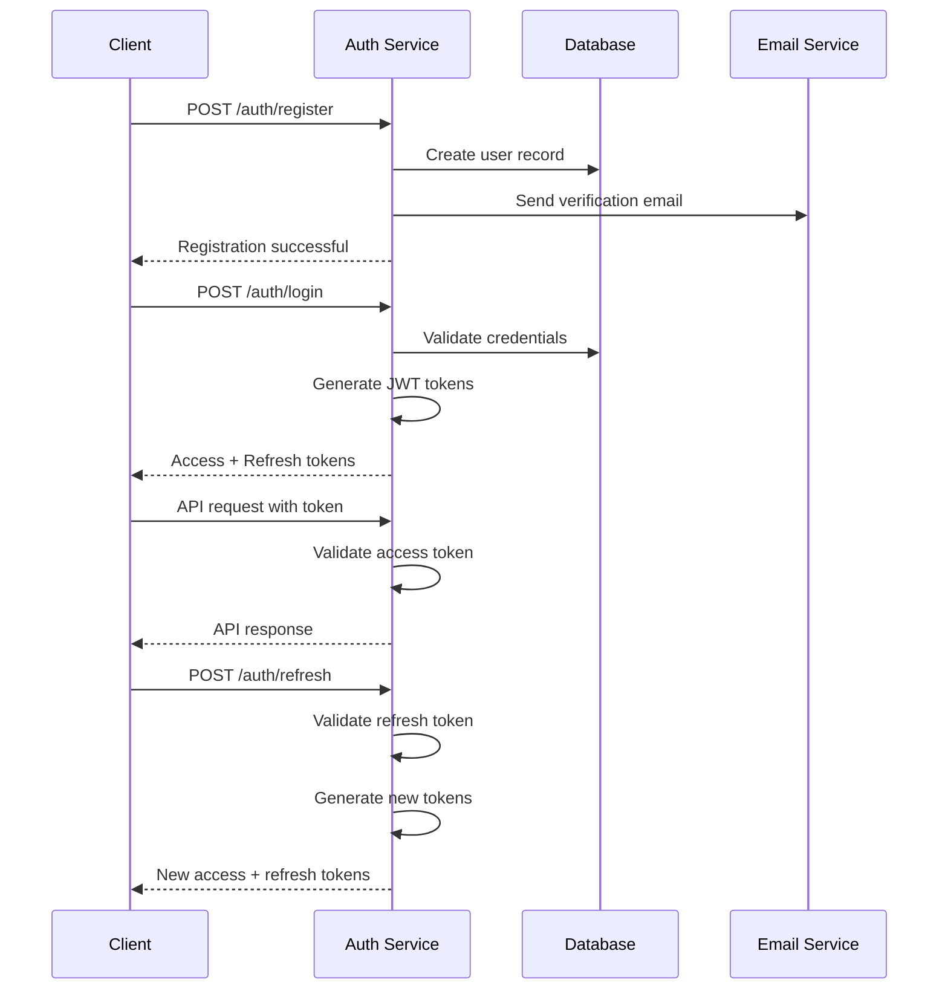

# Authentication & Authorization

## Overview

The Adopt Don't Shop Backend implements a comprehensive authentication and authorization system using JSON Web Tokens (JWT) with role-based access control (RBAC). The system provides secure user authentication, session management, and fine-grained permissions.

## Authentication System

### JWT Token Architecture

The system uses a dual-token approach for enhanced security:

```
┌─────────────────────────────────────────────────────────────┐
│                    Token Architecture                      │
├─────────────────┬─────────────────┬─────────────────────────┤
│  Access Token   │  Refresh Token  │  Session Management     │
│  - Short-lived  │  - Long-lived   │  - Server-side tracking│
│  - 15 minutes   │  - 7 days       │  - Logout handling     │
│  - API access   │  - Token refresh│  - Device tracking     │
└─────────────────┴─────────────────┴─────────────────────────┘
```

#### Access Token
- **Lifetime**: 15 minutes
- **Purpose**: API endpoint access
- **Storage**: Client memory/localStorage
- **Contains**: User ID, email, role, permissions

#### Refresh Token
- **Lifetime**: 7 days
- **Purpose**: Generate new access tokens
- **Storage**: HTTP-only cookie (recommended)
- **Rotation**: New refresh token on each use

### Authentication Flow



## User Registration

### Registration Process

```typescript
POST /api/v1/auth/register
{
  "email": "user@example.com",
  "password": "SecurePassword123!",
  "firstName": "John",
  "lastName": "Doe",
  "userType": "ADOPTER",
  "phoneNumber": "+1234567890"
}
```

### Validation Rules

**Email**:
- Valid email format
- Unique in system
- Domain validation

**Password**:
- Minimum 8 characters
- At least one uppercase letter
- At least one lowercase letter
- At least one number
- At least one special character

**User Types**:
- `ADOPTER`: Regular users looking to adopt
- `RESCUE_STAFF`: Rescue organization staff
- `ADMIN`: System administrators

### Email Verification

```typescript
// Verification email sent automatically
GET /api/v1/auth/verify-email?token=<verification_token>

// Resend verification
POST /api/v1/auth/resend-verification
{
  "email": "user@example.com"
}
```

## User Login

### Login Process

```typescript
POST /api/v1/auth/login
{
  "email": "user@example.com",
  "password": "password"
}

// Response
{
  "success": true,
  "user": {
    "userId": "uuid",
    "email": "user@example.com",
    "firstName": "John",
    "userType": "ADOPTER",
    "emailVerified": true
  },
  "accessToken": "eyJhbGciOiJIUzI1NiIs...",
  "refreshToken": "eyJhbGciOiJIUzI1NiIs...",
  "expiresIn": 900
}
```

### Security Features

**Brute Force Protection**:
- Rate limiting on login attempts
- Account lockout after failed attempts
- Progressive delays
- IP-based tracking

**Session Security**:
- Secure token generation
- Token rotation
- Device tracking
- Concurrent session limits

## Authorization System

### Role-Based Access Control (RBAC)

The system implements a hierarchical role system:

```
┌─────────────────────────────────────────────────────────────┐
│                      Role Hierarchy                        │
├─────────────────────────────────────────────────────────────┤
│  ADMIN                                                      │
│  ├── Full system access                                     │
│  ├── User management                                        │
│  ├── System configuration                                   │
│  └── All rescue and adopter permissions                     │
├─────────────────────────────────────────────────────────────┤
│  RESCUE_STAFF                                               │
│  ├── Manage rescue pets                                     │
│  ├── Process applications                                   │
│  ├── Communicate with adopters                             │
│  └── View rescue analytics                                 │
├─────────────────────────────────────────────────────────────┤
│  ADOPTER                                                    │
│  ├── Browse pets                                           │
│  ├── Submit applications                                    │
│  ├── Communicate with rescues                              │
│  └── Manage profile                                        │
└─────────────────────────────────────────────────────────────┘
```

### Permission System

**Core Permissions**:
```typescript
enum PERMISSIONS {
  // User Management
  USER_READ = 'user:read',
  USER_WRITE = 'user:write',
  USER_DELETE = 'user:delete',
  
  // Pet Management
  PET_READ = 'pet:read',
  PET_WRITE = 'pet:write',
  PET_DELETE = 'pet:delete',
  
  // Application Management
  APPLICATION_READ = 'application:read',
  APPLICATION_WRITE = 'application:write',
  APPLICATION_PROCESS = 'application:process',
  
  // Admin Functions
  ADMIN_ACCESS = 'admin:access',
  SYSTEM_CONFIG = 'system:config',
  USER_IMPERSONATE = 'user:impersonate'
}
```

### Middleware Implementation

#### Authentication Middleware

```typescript
import { authenticateToken } from '../middleware/auth';

// Require authentication
router.get('/protected', authenticateToken, controller);

// Optional authentication
router.get('/public', optionalAuth, controller);
```

#### Authorization Middleware

```typescript
import { requireRole, requirePermission } from '../middleware/rbac';

// Role-based protection
router.get('/admin', requireRole('ADMIN'), controller);

// Permission-based protection
router.delete('/users/:id', requirePermission('USER_DELETE'), controller);

// Ownership-based protection
router.put('/users/:id', requireOwnership('userId'), controller);

// Combined protection
router.put('/pets/:id', 
  requirePermissionOrOwnership('PET_WRITE', 'rescueId'), 
  controller
);
```

## API Authentication

### Token Usage

**Header Format**:
```http
Authorization: Bearer <access_token>
```

**Token Validation**:
1. Extract token from Authorization header
2. Verify JWT signature
3. Check token expiration
4. Validate user existence
5. Inject user context into request

### Error Responses

**401 Unauthorized**:
```json
{
  "success": false,
  "error": "Unauthorized",
  "message": "Invalid or expired token"
}
```

**403 Forbidden**:
```json
{
  "success": false,
  "error": "Forbidden",
  "message": "Insufficient permissions"
}
```

## Password Management

### Password Reset Flow

```typescript
// Request password reset
POST /api/v1/auth/password/forgot
{
  "email": "user@example.com"
}

// Reset password with token
POST /api/v1/auth/password/reset
{
  "token": "reset_token",
  "newPassword": "NewSecurePassword123!"
}
```

### Password Requirements

**Strength Validation**:
- Minimum 8 characters
- Maximum 128 characters
- Character complexity requirements
- Common password prevention
- Personal information prevention

**Security Measures**:
- bcrypt hashing with salt rounds 12
- Password history prevention
- Secure reset token generation
- Token expiration (1 hour)

## Session Management

### Session Lifecycle

```typescript
// Login creates session
POST /api/v1/auth/login
// → Creates access token + refresh token
// → Tracks login timestamp and IP

// Token refresh extends session
POST /api/v1/auth/refresh
// → Validates refresh token
// → Issues new access token
// → Rotates refresh token

// Logout terminates session
POST /api/v1/auth/logout
// → Invalidates refresh token
// → Clears server-side session
```

### Session Security

**Token Rotation**:
- New refresh token on each use
- Invalidate old refresh tokens
- Detect token reuse attacks

**Device Tracking**:
- Track login devices
- Unusual login detection
- Device-based session limits

## Multi-Factor Authentication (Future)

### 2FA Implementation Plan

**TOTP (Time-based One-Time Password)**:
- Google Authenticator support
- Backup codes generation
- Recovery mechanisms

**SMS Verification**:
- Phone number verification
- SMS code delivery
- Rate limiting protection

## Security Best Practices

### Token Security

**Access Token**:
- Short expiration time (15 minutes)
- Store in memory or sessionStorage
- Never store in localStorage for sensitive apps
- Include minimal necessary claims

**Refresh Token**:
- Longer expiration (7 days)
- Store in HTTP-only cookie
- Secure and SameSite flags
- Rotate on each use

### Implementation Security

**Environment Variables**:
```bash
# JWT Configuration
JWT_SECRET=super-secure-secret-key-256-bits
JWT_REFRESH_SECRET=different-refresh-secret-key
JWT_EXPIRES_IN=15m
JWT_REFRESH_EXPIRES_IN=7d

# Security Settings
BCRYPT_ROUNDS=12
MAX_LOGIN_ATTEMPTS=5
LOCKOUT_DURATION=15m
```

**Security Headers**:
```typescript
// Security middleware
app.use(helmet());
app.use(cors({
  origin: process.env.CORS_ORIGIN,
  credentials: true
}));
```

## Rate Limiting

### Authentication Endpoints

**Login Rate Limiting**:
```typescript
// 5 attempts per 15 minutes per IP
const loginLimiter = rateLimit({
  windowMs: 15 * 60 * 1000,
  max: 5,
  message: 'Too many login attempts'
});

app.use('/api/v1/auth/login', loginLimiter);
```

**Registration Rate Limiting**:
```typescript
// 3 registrations per hour per IP
const registerLimiter = rateLimit({
  windowMs: 60 * 60 * 1000,
  max: 3,
  message: 'Too many registration attempts'
});
```

## Audit Logging

### Security Events

**Logged Events**:
- User registration
- Login attempts (success/failure)
- Password changes
- Account lockouts
- Permission changes
- Admin actions

**Log Format**:
```typescript
{
  timestamp: '2024-01-15T10:30:00Z',
  event: 'user_login',
  userId: 'user-uuid',
  ipAddress: '192.168.1.1',
  userAgent: 'Mozilla/5.0...',
  success: true,
  details: {
    loginMethod: 'password',
    deviceType: 'desktop'
  }
}
```

## Testing Authentication

### Development Tools

**Test Users**:
```typescript
// Seed data includes test accounts
{
  email: 'admin@test.com',
  password: 'TestPassword123!',
  userType: 'ADMIN'
}
```

**Token Testing**:
```bash
# Get token
curl -X POST http://localhost:5000/api/v1/auth/login \
  -H "Content-Type: application/json" \
  -d '{"email":"test@example.com","password":"password"}'

# Use token
curl -X GET http://localhost:5000/api/v1/users/me \
  -H "Authorization: Bearer <token>"
```

## Troubleshooting

### Common Issues

**Token Expired**:
- Use refresh token to get new access token
- Check system clock synchronization
- Verify JWT_EXPIRES_IN configuration

**Invalid Token**:
- Verify JWT_SECRET matches
- Check token format and encoding
- Ensure token isn't corrupted

**Permission Denied**:
- Verify user role and permissions
- Check resource ownership
- Review RBAC middleware configuration

### Debug Mode

**Development Logging**:
```typescript
// Enable auth debugging
DEBUG=auth:* npm run dev

// Log levels
logger.debug('Token validation details');
logger.info('User authentication successful');
logger.warn('Failed login attempt');
logger.error('Authentication system error');
```

---

This authentication system provides robust security while maintaining usability and scalability for the Adopt Don't Shop platform. 