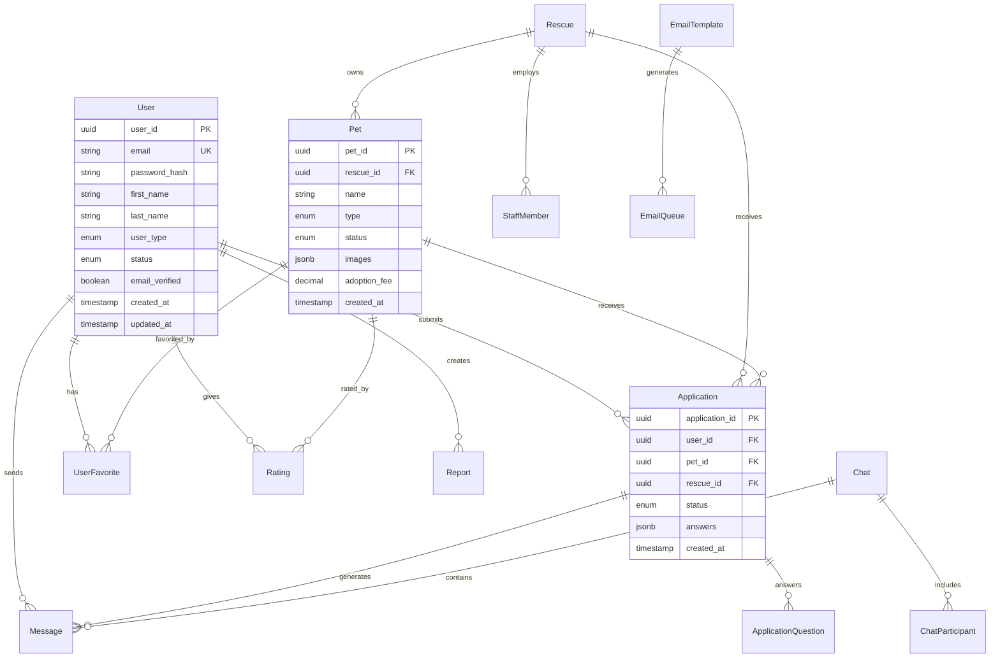

# Database Schema Documentation

## Overview

The Adopt Don't Shop Backend uses PostgreSQL as its primary database with Sequelize ORM for data modeling and migrations. The schema is designed to support a comprehensive pet adoption platform with user management, pet profiles, adoption workflows, messaging, and administrative features.

## Database Architecture

```
┌─────────────────────────────────────────────────────────────┐
│                    Database Architecture                   │
├─────────────────┬─────────────────┬─────────────────────────┤
│   Core Entities │   Workflow      │   Communication         │
│   - Users       │   - Applications│   - Messages            │
│   - Pets        │   - Reviews     │   - Notifications       │
│   - Rescues     │   - Ratings     │   - Email Queue         │
└─────────────────┴─────────────────┴─────────────────────────┘
```

## Entity Relationship Diagram



## Core Tables

### Users Table

**Purpose**: Central user management for all platform participants

```sql
CREATE TABLE users (
    user_id UUID PRIMARY KEY DEFAULT gen_random_uuid(),
    email VARCHAR(255) UNIQUE NOT NULL,
    password_hash VARCHAR(255) NOT NULL,
    first_name VARCHAR(100) NOT NULL,
    last_name VARCHAR(100) NOT NULL,
    phone_number VARCHAR(20),
    user_type user_type_enum NOT NULL DEFAULT 'ADOPTER',
    status user_status_enum NOT NULL DEFAULT 'ACTIVE',
    email_verified BOOLEAN DEFAULT FALSE,
    email_verification_token VARCHAR(255),
    email_verification_expires TIMESTAMP,
    password_reset_token VARCHAR(255),
    password_reset_expires TIMESTAMP,
    profile_image_url TEXT,
    bio TEXT,
    location VARCHAR(255),
    preferences JSONB DEFAULT '{}',
    last_login_at TIMESTAMP,
    login_count INTEGER DEFAULT 0,
    failed_login_attempts INTEGER DEFAULT 0,
    locked_until TIMESTAMP,
    created_at TIMESTAMP DEFAULT CURRENT_TIMESTAMP,
    updated_at TIMESTAMP DEFAULT CURRENT_TIMESTAMP,
    deleted_at TIMESTAMP
);

-- Enums
CREATE TYPE user_type_enum AS ENUM ('ADOPTER', 'RESCUE_STAFF', 'ADMIN');
CREATE TYPE user_status_enum AS ENUM ('ACTIVE', 'INACTIVE', 'PENDING_VERIFICATION', 'SUSPENDED');

-- Indexes
CREATE INDEX idx_users_email ON users(email);
CREATE INDEX idx_users_type ON users(user_type);
CREATE INDEX idx_users_status ON users(status);
CREATE INDEX idx_users_created_at ON users(created_at);
```

**Key Features**:
- UUID primary keys for security
- Soft delete support
- Email verification workflow
- Password reset functionality
- User preferences as JSONB
- Login tracking and security

### Rescues Table

**Purpose**: Rescue organization profiles and information

```sql
CREATE TABLE rescues (
    rescue_id UUID PRIMARY KEY DEFAULT gen_random_uuid(),
    name VARCHAR(255) NOT NULL,
    email VARCHAR(255) UNIQUE NOT NULL,
    phone VARCHAR(20),
    address TEXT NOT NULL,
    city VARCHAR(100) NOT NULL,
    state VARCHAR(100) NOT NULL,
    zip_code VARCHAR(20) NOT NULL,
    country VARCHAR(100) NOT NULL DEFAULT 'United States',
    website VARCHAR(255),
    description TEXT,
    mission TEXT,
    ein VARCHAR(20), -- Tax ID
    registration_number VARCHAR(100),
    contact_person VARCHAR(255) NOT NULL,
    contact_title VARCHAR(100),
    contact_email VARCHAR(255),
    contact_phone VARCHAR(20),
    status rescue_status_enum NOT NULL DEFAULT 'pending',
    verified_at TIMESTAMP,
    verified_by UUID REFERENCES users(user_id),
    settings JSONB DEFAULT '{}',
    created_at TIMESTAMP DEFAULT CURRENT_TIMESTAMP,
    updated_at TIMESTAMP DEFAULT CURRENT_TIMESTAMP,
    deleted_at TIMESTAMP
);

CREATE TYPE rescue_status_enum AS ENUM ('pending', 'verified', 'suspended', 'inactive');

-- Indexes
CREATE INDEX idx_rescues_status ON rescues(status);
CREATE INDEX idx_rescues_location ON rescues(city, state);
CREATE INDEX idx_rescues_verified ON rescues(verified_at);
```

### Pets Table

**Purpose**: Comprehensive pet profiles with rich metadata

```sql
CREATE TABLE pets (
    pet_id UUID PRIMARY KEY DEFAULT gen_random_uuid(),
    rescue_id UUID NOT NULL REFERENCES rescues(rescue_id),
    name VARCHAR(100) NOT NULL,
    short_description TEXT,
    long_description TEXT,
    age_years INTEGER,
    age_months INTEGER,
    age_group age_group_enum NOT NULL,
    gender gender_enum NOT NULL,
    status pet_status_enum NOT NULL DEFAULT 'available',
    type pet_type_enum NOT NULL,
    breed VARCHAR(100),
    secondary_breed VARCHAR(100),
    weight_kg DECIMAL(5,2),
    size size_enum NOT NULL,
    color VARCHAR(100),
    markings TEXT,
    microchip_id VARCHAR(50),
    
    -- Behavioral attributes
    special_needs BOOLEAN DEFAULT FALSE,
    special_needs_description TEXT,
    house_trained BOOLEAN DEFAULT FALSE,
    good_with_children BOOLEAN,
    good_with_dogs BOOLEAN,
    good_with_cats BOOLEAN,
    good_with_small_animals BOOLEAN,
    energy_level energy_level_enum NOT NULL,
    exercise_needs TEXT,
    grooming_needs TEXT,
    training_notes TEXT,
    temperament TEXT[],
    
    -- Medical information
    medical_notes TEXT,
    vaccination_status vaccination_status_enum NOT NULL,
    vaccination_date DATE,
    spay_neuter_status spay_neuter_status_enum NOT NULL,
    spay_neuter_date DATE,
    last_vet_checkup DATE,
    
    -- Administrative
    behavioral_notes TEXT,
    surrender_reason TEXT,
    intake_date DATE,
    adoption_fee DECIMAL(8,2),
    
    -- Media and location
    images JSONB DEFAULT '[]',
    videos JSONB DEFAULT '[]',
    location GEOGRAPHY(POINT, 4326),
    
    -- Timestamps and status
    available_since TIMESTAMP,
    adopted_date TIMESTAMP,
    foster_start_date TIMESTAMP,
    foster_end_date TIMESTAMP,
    
    -- Metrics
    view_count INTEGER DEFAULT 0,
    favorite_count INTEGER DEFAULT 0,
    application_count INTEGER DEFAULT 0,
    
    -- Search
    search_vector TSVECTOR,
    tags TEXT[],
    
    -- Audit
    archived BOOLEAN DEFAULT FALSE,
    featured BOOLEAN DEFAULT FALSE,
    priority_listing BOOLEAN DEFAULT FALSE,
    created_at TIMESTAMP DEFAULT CURRENT_TIMESTAMP,
    updated_at TIMESTAMP DEFAULT CURRENT_TIMESTAMP,
    deleted_at TIMESTAMP
);

-- Enums for pets
CREATE TYPE pet_type_enum AS ENUM ('DOG', 'CAT', 'RABBIT', 'BIRD', 'REPTILE', 'SMALL_MAMMAL', 'FISH', 'OTHER');
CREATE TYPE gender_enum AS ENUM ('MALE', 'FEMALE', 'UNKNOWN');
CREATE TYPE size_enum AS ENUM ('EXTRA_SMALL', 'SMALL', 'MEDIUM', 'LARGE', 'EXTRA_LARGE');
CREATE TYPE age_group_enum AS ENUM ('BABY', 'YOUNG', 'ADULT', 'SENIOR');
CREATE TYPE energy_level_enum AS ENUM ('LOW', 'MEDIUM', 'HIGH', 'VERY_HIGH');
CREATE TYPE pet_status_enum AS ENUM ('AVAILABLE', 'PENDING', 'ADOPTED', 'FOSTER', 'MEDICAL_HOLD', 'BEHAVIORAL_HOLD', 'NOT_AVAILABLE', 'DECEASED');
CREATE TYPE vaccination_status_enum AS ENUM ('UP_TO_DATE', 'PARTIAL', 'NOT_VACCINATED', 'UNKNOWN');
CREATE TYPE spay_neuter_status_enum AS ENUM ('SPAYED', 'NEUTERED', 'NOT_ALTERED', 'UNKNOWN');

-- Indexes for pets
CREATE INDEX idx_pets_rescue ON pets(rescue_id);
CREATE INDEX idx_pets_type ON pets(type);
CREATE INDEX idx_pets_status ON pets(status);
CREATE INDEX idx_pets_size ON pets(size);
CREATE INDEX idx_pets_age_group ON pets(age_group);
CREATE INDEX idx_pets_location ON pets USING GIST(location);
CREATE INDEX idx_pets_search ON pets USING GIN(search_vector);
CREATE INDEX idx_pets_featured ON pets(featured, created_at);
CREATE INDEX idx_pets_available ON pets(status, available_since);

-- Full-text search trigger
CREATE OR REPLACE FUNCTION update_pet_search_vector()
RETURNS TRIGGER AS $$
BEGIN
    NEW.search_vector := 
        setweight(to_tsvector('english', COALESCE(NEW.name, '')), 'A') ||
        setweight(to_tsvector('english', COALESCE(NEW.breed, '')), 'B') ||
        setweight(to_tsvector('english', COALESCE(NEW.short_description, '')), 'C') ||
        setweight(to_tsvector('english', COALESCE(NEW.long_description, '')), 'D');
    RETURN NEW;
END;
$$ LANGUAGE plpgsql;

CREATE TRIGGER update_pet_search_trigger
    BEFORE INSERT OR UPDATE ON pets
    FOR EACH ROW EXECUTE FUNCTION update_pet_search_vector();
```

## Application Workflow Tables

### Applications Table

**Purpose**: Adoption application management with dynamic questions

```sql
CREATE TABLE applications (
    application_id UUID PRIMARY KEY DEFAULT gen_random_uuid(),
    user_id UUID NOT NULL REFERENCES users(user_id),
    pet_id UUID NOT NULL REFERENCES pets(pet_id),
    rescue_id UUID NOT NULL REFERENCES rescues(rescue_id),
    status application_status_enum NOT NULL DEFAULT 'draft',
    priority application_priority_enum NOT NULL DEFAULT 'normal',
    
    -- Decision tracking
    actioned_by UUID REFERENCES users(user_id),
    actioned_at TIMESTAMP,
    rejection_reason TEXT,
    conditional_requirements TEXT[],
    
    -- Application data
    answers JSONB NOT NULL DEFAULT '{}',
    references JSONB DEFAULT '[]',
    documents JSONB DEFAULT '[]',
    
    -- Process notes
    interview_notes TEXT,
    home_visit_notes TEXT,
    score INTEGER CHECK (score >= 0 AND score <= 100),
    tags TEXT[],
    notes TEXT,
    
    -- Timeline
    submitted_at TIMESTAMP,
    reviewed_at TIMESTAMP,
    decision_at TIMESTAMP,
    expires_at TIMESTAMP,
    follow_up_date DATE,
    
    created_at TIMESTAMP DEFAULT CURRENT_TIMESTAMP,
    updated_at TIMESTAMP DEFAULT CURRENT_TIMESTAMP,
    deleted_at TIMESTAMP
);

CREATE TYPE application_status_enum AS ENUM (
    'draft', 'submitted', 'under_review', 'pending_references',
    'reference_check', 'interview_scheduled', 'interview_completed',
    'home_visit_scheduled', 'home_visit_completed', 'approved',
    'conditionally_approved', 'rejected', 'withdrawn', 'expired'
);

CREATE TYPE application_priority_enum AS ENUM ('low', 'normal', 'high', 'urgent');

-- Indexes
CREATE INDEX idx_applications_user ON applications(user_id);
CREATE INDEX idx_applications_pet ON applications(pet_id);
CREATE INDEX idx_applications_rescue ON applications(rescue_id);
CREATE INDEX idx_applications_status ON applications(status);
CREATE INDEX idx_applications_submitted ON applications(submitted_at);
CREATE UNIQUE INDEX idx_applications_user_pet ON applications(user_id, pet_id) WHERE deleted_at IS NULL;
```

### Application Questions Table

**Purpose**: Dynamic question system for adoption applications

```sql
CREATE TABLE application_questions (
    question_id UUID PRIMARY KEY DEFAULT gen_random_uuid(),
    rescue_id UUID REFERENCES rescues(rescue_id), -- NULL for core questions
    question_key VARCHAR(100) NOT NULL,
    scope question_scope_enum NOT NULL,
    category question_category_enum NOT NULL,
    question_type question_type_enum NOT NULL,
    question_text TEXT NOT NULL,
    help_text TEXT,
    placeholder TEXT,
    options TEXT[], -- For select/multi-select questions
    validation_rules JSONB,
    display_order INTEGER NOT NULL DEFAULT 0,
    is_enabled BOOLEAN DEFAULT TRUE,
    is_required BOOLEAN DEFAULT FALSE,
    conditional_logic JSONB, -- Show/hide based on other answers
    created_at TIMESTAMP DEFAULT CURRENT_TIMESTAMP,
    updated_at TIMESTAMP DEFAULT CURRENT_TIMESTAMP,
    deleted_at TIMESTAMP
);

CREATE TYPE question_scope_enum AS ENUM ('core', 'rescue_specific');
CREATE TYPE question_category_enum AS ENUM (
    'personal_information', 'household_information', 'pet_ownership_experience',
    'lifestyle_compatibility', 'pet_care_commitment', 'references_verification',
    'final_acknowledgments'
);
CREATE TYPE question_type_enum AS ENUM (
    'text', 'email', 'phone', 'number', 'boolean', 'select',
    'multi_select', 'address', 'date', 'file'
);

-- Indexes
CREATE INDEX idx_app_questions_rescue ON application_questions(rescue_id);
CREATE INDEX idx_app_questions_scope ON application_questions(scope);
CREATE INDEX idx_app_questions_category ON application_questions(category);
CREATE UNIQUE INDEX idx_app_questions_key_rescue ON application_questions(question_key, rescue_id);
```

## Communication Tables

### Chats Table

**Purpose**: Conversation containers for messaging

```sql
CREATE TABLE chats (
    chat_id UUID PRIMARY KEY DEFAULT gen_random_uuid(),
    application_id UUID REFERENCES applications(application_id),
    rescue_id UUID NOT NULL REFERENCES rescues(rescue_id),
    status chat_status_enum NOT NULL DEFAULT 'active',
    created_at TIMESTAMP DEFAULT CURRENT_TIMESTAMP,
    updated_at TIMESTAMP DEFAULT CURRENT_TIMESTAMP
);

CREATE TYPE chat_status_enum AS ENUM ('active', 'locked', 'archived');

-- Indexes
CREATE INDEX idx_chats_application ON chats(application_id);
CREATE INDEX idx_chats_rescue ON chats(rescue_id);
CREATE INDEX idx_chats_status ON chats(status);
```

### Chat Participants Table

**Purpose**: Many-to-many relationship between users and conversations

```sql
CREATE TABLE chat_participants (
    chat_participant_id UUID PRIMARY KEY DEFAULT gen_random_uuid(),
    chat_id UUID NOT NULL REFERENCES chats(chat_id) ON DELETE CASCADE,
    participant_id UUID NOT NULL REFERENCES users(user_id),
    role participant_role_enum NOT NULL,
    last_read_at TIMESTAMP DEFAULT CURRENT_TIMESTAMP,
    created_at TIMESTAMP DEFAULT CURRENT_TIMESTAMP,
    updated_at TIMESTAMP DEFAULT CURRENT_TIMESTAMP
);

CREATE TYPE participant_role_enum AS ENUM ('rescue', 'user');

-- Indexes
CREATE UNIQUE INDEX idx_chat_participants_unique ON chat_participants(chat_id, participant_id);
CREATE INDEX idx_chat_participants_user ON chat_participants(participant_id);
```

### Messages Table

**Purpose**: Individual messages with rich content support

```sql
CREATE TABLE messages (
    message_id UUID PRIMARY KEY DEFAULT gen_random_uuid(),
    chat_id UUID NOT NULL REFERENCES chats(chat_id) ON DELETE CASCADE,
    sender_id UUID NOT NULL REFERENCES users(user_id),
    content TEXT NOT NULL,
    content_format message_format_enum DEFAULT 'plain',
    attachments JSONB DEFAULT '[]',
    reactions JSONB DEFAULT '[]',
    read_status JSONB DEFAULT '[]',
    search_vector TSVECTOR,
    created_at TIMESTAMP DEFAULT CURRENT_TIMESTAMP,
    updated_at TIMESTAMP DEFAULT CURRENT_TIMESTAMP
);

CREATE TYPE message_format_enum AS ENUM ('plain', 'markdown', 'html');

-- Indexes
CREATE INDEX idx_messages_chat ON messages(chat_id, created_at);
CREATE INDEX idx_messages_sender ON messages(sender_id);
CREATE INDEX idx_messages_search ON messages USING GIN(search_vector);

-- Message search trigger
CREATE OR REPLACE FUNCTION update_message_search_vector()
RETURNS TRIGGER AS $$
BEGIN
    NEW.search_vector := to_tsvector('english', COALESCE(NEW.content, ''));
    RETURN NEW;
END;
$$ LANGUAGE plpgsql;

CREATE TRIGGER update_message_search_trigger
    BEFORE INSERT OR UPDATE ON messages
    FOR EACH ROW EXECUTE FUNCTION update_message_search_vector();
```

## Email System Tables

### Email Templates Table

**Purpose**: Manage email templates with versioning

```sql
CREATE TABLE email_templates (
    template_id UUID PRIMARY KEY DEFAULT gen_random_uuid(),
    name VARCHAR(255) NOT NULL,
    description TEXT,
    type template_type_enum NOT NULL,
    category template_category_enum NOT NULL,
    status template_status_enum NOT NULL DEFAULT 'draft',
    subject VARCHAR(500) NOT NULL,
    html_content TEXT NOT NULL,
    text_content TEXT,
    variables JSONB DEFAULT '[]', -- Template variables definition
    metadata JSONB DEFAULT '{}',
    locale VARCHAR(10) DEFAULT 'en-US',
    parent_template_id UUID REFERENCES email_templates(template_id),
    versions JSONB DEFAULT '[]', -- Version history
    current_version INTEGER DEFAULT 1,
    is_default BOOLEAN DEFAULT FALSE,
    priority INTEGER DEFAULT 0,
    tags TEXT[],
    created_by UUID NOT NULL REFERENCES users(user_id),
    last_modified_by UUID REFERENCES users(user_id),
    last_used_at TIMESTAMP,
    usage_count INTEGER DEFAULT 0,
    test_emails_sent INTEGER DEFAULT 0,
    created_at TIMESTAMP DEFAULT CURRENT_TIMESTAMP,
    updated_at TIMESTAMP DEFAULT CURRENT_TIMESTAMP,
    deleted_at TIMESTAMP
);

CREATE TYPE template_type_enum AS ENUM ('transactional', 'notification', 'marketing', 'system', 'administrative');
CREATE TYPE template_category_enum AS ENUM (
    'welcome', 'password_reset', 'email_verification', 'application_update',
    'adoption_confirmation', 'rescue_verification', 'staff_invitation',
    'notification_digest', 'reminder', 'announcement', 'newsletter', 'system_alert'
);
CREATE TYPE template_status_enum AS ENUM ('draft', 'active', 'inactive', 'archived');

-- Indexes
CREATE INDEX idx_email_templates_type ON email_templates(type);
CREATE INDEX idx_email_templates_category ON email_templates(category);
CREATE INDEX idx_email_templates_status ON email_templates(status);
CREATE UNIQUE INDEX idx_email_templates_name ON email_templates(name) WHERE deleted_at IS NULL;
```

### Email Queue Table

**Purpose**: Email delivery queue with tracking

```sql
CREATE TABLE email_queue (
    email_id UUID PRIMARY KEY DEFAULT gen_random_uuid(),
    template_id UUID REFERENCES email_templates(template_id),
    from_email VARCHAR(255) NOT NULL,
    from_name VARCHAR(255),
    to_email VARCHAR(255) NOT NULL,
    to_name VARCHAR(255),
    cc_emails TEXT[],
    bcc_emails TEXT[],
    reply_to_email VARCHAR(255),
    subject VARCHAR(500) NOT NULL,
    html_content TEXT NOT NULL,
    text_content TEXT,
    template_data JSONB,
    attachments JSONB DEFAULT '[]',
    type email_type_enum NOT NULL,
    priority email_priority_enum NOT NULL DEFAULT 'normal',
    status email_status_enum NOT NULL DEFAULT 'queued',
    scheduled_for TIMESTAMP,
    max_retries INTEGER DEFAULT 3,
    current_retries INTEGER DEFAULT 0,
    last_attempt_at TIMESTAMP,
    sent_at TIMESTAMP,
    failure_reason TEXT,
    provider_id VARCHAR(255), -- External email service ID
    provider_message_id VARCHAR(255),
    tracking JSONB DEFAULT '{}', -- Open/click tracking
    metadata JSONB DEFAULT '{}',
    campaign_id VARCHAR(255),
    user_id UUID REFERENCES users(user_id),
    created_by UUID REFERENCES users(user_id),
    tags TEXT[],
    created_at TIMESTAMP DEFAULT CURRENT_TIMESTAMP,
    updated_at TIMESTAMP DEFAULT CURRENT_TIMESTAMP
);

CREATE TYPE email_type_enum AS ENUM ('transactional', 'notification', 'marketing', 'system');
CREATE TYPE email_priority_enum AS ENUM ('low', 'normal', 'high', 'urgent');
CREATE TYPE email_status_enum AS ENUM (
    'queued', 'sending', 'sent', 'delivered', 'opened',
    'clicked', 'failed', 'bounced', 'unsubscribed'
);

-- Indexes
CREATE INDEX idx_email_queue_status ON email_queue(status);
CREATE INDEX idx_email_queue_scheduled ON email_queue(scheduled_for);
CREATE INDEX idx_email_queue_priority ON email_queue(priority, created_at);
CREATE INDEX idx_email_queue_user ON email_queue(user_id);
CREATE INDEX idx_email_queue_template ON email_queue(template_id);
```

## User Preference Tables

### Email Preferences Table

**Purpose**: User email notification preferences

```sql
CREATE TABLE email_preferences (
    preference_id UUID PRIMARY KEY DEFAULT gen_random_uuid(),
    user_id UUID NOT NULL REFERENCES users(user_id) ON DELETE CASCADE,
    is_email_enabled BOOLEAN DEFAULT TRUE,
    global_unsubscribe BOOLEAN DEFAULT FALSE,
    preferences JSONB NOT NULL DEFAULT '[]', -- Notification preferences array
    language VARCHAR(10) DEFAULT 'en-US',
    timezone VARCHAR(50) DEFAULT 'UTC',
    email_format email_format_enum DEFAULT 'html',
    digest_frequency digest_frequency_enum DEFAULT 'daily',
    digest_time TIME DEFAULT '09:00:00',
    unsubscribe_token VARCHAR(255) UNIQUE,
    last_digest_sent TIMESTAMP,
    bounce_count INTEGER DEFAULT 0,
    last_bounce_at TIMESTAMP,
    is_blacklisted BOOLEAN DEFAULT FALSE,
    blacklist_reason TEXT,
    blacklisted_at TIMESTAMP,
    metadata JSONB DEFAULT '{}',
    created_at TIMESTAMP DEFAULT CURRENT_TIMESTAMP,
    updated_at TIMESTAMP DEFAULT CURRENT_TIMESTAMP
);

CREATE TYPE email_format_enum AS ENUM ('html', 'text', 'both');
CREATE TYPE digest_frequency_enum AS ENUM ('immediate', 'daily', 'weekly', 'monthly', 'never');

-- Indexes
CREATE UNIQUE INDEX idx_email_preferences_user ON email_preferences(user_id);
CREATE INDEX idx_email_preferences_unsubscribe ON email_preferences(unsubscribe_token);
CREATE INDEX idx_email_preferences_digest ON email_preferences(digest_frequency, digest_time);
```

## Moderation Tables

### Reports Table

**Purpose**: Content and user reporting system

```sql
CREATE TABLE reports (
    report_id UUID PRIMARY KEY DEFAULT gen_random_uuid(),
    reporter_id UUID NOT NULL REFERENCES users(user_id),
    reported_entity_type entity_type_enum NOT NULL,
    reported_entity_id UUID NOT NULL,
    reported_user_id UUID REFERENCES users(user_id),
    category report_category_enum NOT NULL,
    severity report_severity_enum NOT NULL,
    status report_status_enum NOT NULL DEFAULT 'pending',
    title VARCHAR(255) NOT NULL,
    description TEXT NOT NULL,
    evidence JSONB DEFAULT '[]', -- Screenshots, URLs, etc.
    metadata JSONB DEFAULT '{}',
    assigned_moderator UUID REFERENCES users(user_id),
    assigned_at TIMESTAMP,
    resolved_by UUID REFERENCES users(user_id),
    resolved_at TIMESTAMP,
    resolution TEXT,
    resolution_notes TEXT,
    escalated_to UUID REFERENCES users(user_id),
    escalated_at TIMESTAMP,
    escalation_reason TEXT,
    created_at TIMESTAMP DEFAULT CURRENT_TIMESTAMP,
    updated_at TIMESTAMP DEFAULT CURRENT_TIMESTAMP
);

CREATE TYPE entity_type_enum AS ENUM ('user', 'rescue', 'pet', 'application', 'message', 'conversation');
CREATE TYPE report_category_enum AS ENUM (
    'inappropriate_content', 'spam', 'harassment', 'false_information',
    'scam', 'animal_welfare', 'identity_theft', 'other'
);
CREATE TYPE report_severity_enum AS ENUM ('low', 'medium', 'high', 'critical');
CREATE TYPE report_status_enum AS ENUM ('pending', 'under_review', 'resolved', 'dismissed', 'escalated');

-- Indexes
CREATE INDEX idx_reports_reporter ON reports(reporter_id);
CREATE INDEX idx_reports_entity ON reports(reported_entity_type, reported_entity_id);
CREATE INDEX idx_reports_status ON reports(status);
CREATE INDEX idx_reports_assigned ON reports(assigned_moderator);
```

### Moderator Actions Table

**Purpose**: Track moderation actions and decisions

```sql
CREATE TABLE moderator_actions (
    action_id UUID PRIMARY KEY DEFAULT gen_random_uuid(),
    moderator_id UUID NOT NULL REFERENCES users(user_id),
    report_id UUID REFERENCES reports(report_id),
    target_entity_type entity_type_enum NOT NULL,
    target_entity_id UUID NOT NULL,
    target_user_id UUID REFERENCES users(user_id),
    action_type action_type_enum NOT NULL,
    severity action_severity_enum NOT NULL,
    reason TEXT NOT NULL,
    description TEXT,
    metadata JSONB DEFAULT '{}',
    duration INTEGER, -- Duration in hours for temporary actions
    expires_at TIMESTAMP,
    is_active BOOLEAN DEFAULT TRUE,
    reversed_by UUID REFERENCES users(user_id),
    reversed_at TIMESTAMP,
    reversal_reason TEXT,
    evidence JSONB DEFAULT '[]',
    notification_sent BOOLEAN DEFAULT FALSE,
    internal_notes TEXT,
    created_at TIMESTAMP DEFAULT CURRENT_TIMESTAMP,
    updated_at TIMESTAMP DEFAULT CURRENT_TIMESTAMP
);

CREATE TYPE action_type_enum AS ENUM (
    'warning_issued', 'content_removed', 'user_suspended', 'user_banned',
    'account_restricted', 'content_flagged', 'report_dismissed',
    'escalation', 'appeal_reviewed', 'no_action'
);
CREATE TYPE action_severity_enum AS ENUM ('low', 'medium', 'high', 'critical');

-- Indexes
CREATE INDEX idx_moderator_actions_moderator ON moderator_actions(moderator_id);
CREATE INDEX idx_moderator_actions_target ON moderator_actions(target_entity_type, target_entity_id);
CREATE INDEX idx_moderator_actions_user ON moderator_actions(target_user_id);
CREATE INDEX idx_moderator_actions_active ON moderator_actions(is_active, expires_at);
```

## Analytics Tables

### Audit Logs Table

**Purpose**: Comprehensive system audit trail

```sql
CREATE TABLE audit_logs (
    id BIGSERIAL PRIMARY KEY,
    service VARCHAR(100) NOT NULL,
    user_id UUID REFERENCES users(user_id),
    action VARCHAR(100) NOT NULL,
    level audit_level_enum NOT NULL DEFAULT 'INFO',
    timestamp TIMESTAMP DEFAULT CURRENT_TIMESTAMP,
    metadata JSONB,
    category VARCHAR(100) NOT NULL,
    ip_address INET,
    user_agent TEXT,
    session_id VARCHAR(255),
    request_id VARCHAR(255),
    duration_ms INTEGER,
    success BOOLEAN DEFAULT TRUE,
    error_message TEXT
);

CREATE TYPE audit_level_enum AS ENUM ('INFO', 'WARNING', 'ERROR');

-- Indexes
CREATE INDEX idx_audit_logs_user ON audit_logs(user_id);
CREATE INDEX idx_audit_logs_action ON audit_logs(action);
CREATE INDEX idx_audit_logs_timestamp ON audit_logs(timestamp);
CREATE INDEX idx_audit_logs_category ON audit_logs(category);
CREATE INDEX idx_audit_logs_level ON audit_logs(level);

-- Partitioning by month for performance
CREATE TABLE audit_logs_y2024m01 PARTITION OF audit_logs
    FOR VALUES FROM ('2024-01-01') TO ('2024-02-01');
-- Additional partitions would be created monthly
```

## Utility Tables

### Feature Flags Table

**Purpose**: Dynamic feature flag management

```sql
CREATE TABLE feature_flags (
    flag_id UUID PRIMARY KEY DEFAULT gen_random_uuid(),
    name VARCHAR(100) UNIQUE NOT NULL,
    description TEXT,
    enabled BOOLEAN DEFAULT FALSE,
    config JSONB DEFAULT '{}',
    created_at TIMESTAMP DEFAULT CURRENT_TIMESTAMP,
    updated_at TIMESTAMP DEFAULT CURRENT_TIMESTAMP
);

-- Indexes
CREATE UNIQUE INDEX idx_feature_flags_name ON feature_flags(name);
CREATE INDEX idx_feature_flags_enabled ON feature_flags(enabled);
```

### User Favorites Table

**Purpose**: User's favorite pets

```sql
CREATE TABLE user_favorites (
    favorite_id UUID PRIMARY KEY DEFAULT gen_random_uuid(),
    user_id UUID NOT NULL REFERENCES users(user_id) ON DELETE CASCADE,
    pet_id UUID NOT NULL REFERENCES pets(pet_id) ON DELETE CASCADE,
    created_at TIMESTAMP DEFAULT CURRENT_TIMESTAMP
);

-- Indexes
CREATE UNIQUE INDEX idx_user_favorites_unique ON user_favorites(user_id, pet_id);
CREATE INDEX idx_user_favorites_user ON user_favorites(user_id);
CREATE INDEX idx_user_favorites_pet ON user_favorites(pet_id);
```

## Database Constraints and Rules

### Foreign Key Constraints

```sql
-- Ensure referential integrity
ALTER TABLE pets ADD CONSTRAINT fk_pets_rescue 
    FOREIGN KEY (rescue_id) REFERENCES rescues(rescue_id);

ALTER TABLE applications ADD CONSTRAINT fk_applications_user 
    FOREIGN KEY (user_id) REFERENCES users(user_id);

ALTER TABLE applications ADD CONSTRAINT fk_applications_pet 
    FOREIGN KEY (pet_id) REFERENCES pets(pet_id);

-- Cascade deletes where appropriate
ALTER TABLE chat_participants ADD CONSTRAINT fk_chat_participants_chat 
    FOREIGN KEY (chat_id) REFERENCES chats(chat_id) ON DELETE CASCADE;
```

### Check Constraints

```sql
-- Data validation constraints
ALTER TABLE pets ADD CONSTRAINT chk_pets_age_valid 
    CHECK (age_years >= 0 AND age_years <= 30);

ALTER TABLE pets ADD CONSTRAINT chk_pets_weight_valid 
    CHECK (weight_kg > 0 AND weight_kg <= 200);

ALTER TABLE applications ADD CONSTRAINT chk_applications_score_valid 
    CHECK (score >= 0 AND score <= 100);

ALTER TABLE email_queue ADD CONSTRAINT chk_email_retries_valid 
    CHECK (current_retries >= 0 AND current_retries <= max_retries);
```

### Unique Constraints

```sql
-- Business rule constraints
ALTER TABLE users ADD CONSTRAINT uk_users_email UNIQUE (email);
ALTER TABLE rescues ADD CONSTRAINT uk_rescues_email UNIQUE (email);

-- Prevent duplicate applications
ALTER TABLE applications ADD CONSTRAINT uk_applications_user_pet 
    UNIQUE (user_id, pet_id) WHERE deleted_at IS NULL;
```

## Database Performance Optimization

### Indexing Strategy

**Primary Indexes**:
- All foreign keys are indexed
- Frequently queried columns have indexes
- Composite indexes for common query patterns

**Search Indexes**:
- Full-text search on pets and messages
- GiST indexes for geographic queries
- GIN indexes for JSONB columns

**Partial Indexes**:
- Active records only (WHERE deleted_at IS NULL)
- Status-specific indexes

### Query Optimization

**Common Queries**:
```sql
-- Pet search with filters
EXPLAIN ANALYZE SELECT * FROM pets 
WHERE type = 'DOG' 
  AND status = 'AVAILABLE' 
  AND good_with_children = true
  AND deleted_at IS NULL
ORDER BY featured DESC, created_at DESC
LIMIT 20;

-- User's applications
EXPLAIN ANALYZE SELECT a.*, p.name as pet_name, r.name as rescue_name
FROM applications a
JOIN pets p ON a.pet_id = p.pet_id
JOIN rescues r ON a.rescue_id = r.rescue_id
WHERE a.user_id = $1
ORDER BY a.created_at DESC;

-- Message search
EXPLAIN ANALYZE SELECT * FROM messages
WHERE search_vector @@ plainto_tsquery('english', $1)
  AND chat_id = $2
ORDER BY created_at DESC;
```

### Maintenance

**Regular Maintenance Tasks**:
```sql
-- Update table statistics
ANALYZE pets;
ANALYZE applications;
ANALYZE messages;

-- Reindex for optimal performance
REINDEX INDEX idx_pets_search;
REINDEX INDEX idx_messages_search;

-- Clean up old audit logs (keep 2 years)
DELETE FROM audit_logs 
WHERE timestamp < NOW() - INTERVAL '2 years';
```

## Data Migration and Seeding

### Migration Files

The database schema is managed through Sequelize migrations:

```typescript
// Example migration file
export async function up(queryInterface: QueryInterface) {
  await queryInterface.createTable('users', {
    user_id: {
      type: DataTypes.UUID,
      defaultValue: DataTypes.UUIDV4,
      primaryKey: true,
    },
    email: {
      type: DataTypes.STRING,
      allowNull: false,
      unique: true,
    },
    // ... other columns
  });
}
```

### Seed Data

Development and testing seed data:

```typescript
// Example seeder
export async function up(queryInterface: QueryInterface) {
  await queryInterface.bulkInsert('users', [
    {
      user_id: '550e8400-e29b-41d4-a716-446655440000',
      email: 'admin@test.com',
      user_type: 'ADMIN',
      // ... other fields
    },
  ]);
}
```

## Backup and Recovery

### Backup Strategy

**Daily Backups**:
```bash
# Full database backup
pg_dump -h localhost -U postgres adopt_dont_shop > backup_$(date +%Y%m%d).sql

# Compressed backup
pg_dump -h localhost -U postgres adopt_dont_shop | gzip > backup_$(date +%Y%m%d).sql.gz
```

**Point-in-Time Recovery**:
- WAL archiving enabled
- Continuous backup to S3
- Recovery testing procedures

### Disaster Recovery

**Recovery Procedures**:
```bash
# Restore from backup
psql -h localhost -U postgres -d adopt_dont_shop_new < backup_20240115.sql

# Point-in-time recovery
pg_basebackup -h localhost -D /var/lib/postgresql/backup -U postgres -P -W
```

---

This database schema provides a robust foundation for the Adopt Don't Shop platform, supporting all core functionality while maintaining data integrity, performance, and scalability. 